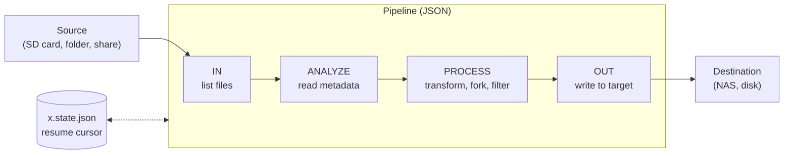

<h1 align="center">
  <br>
  Copybot
</h1>

<p align="center"><em>A file-copying robot that sorts, checks and resumes — built so that a photo import never loses a file and never imports one twice.</em></p>

<p align="center">
  
  
  
  
  <a href="LICENSE"></a>
</p>

You put a memory card in the reader and you want its photos on the NAS,
sorted by capture date, and only the ones you have not imported yet.
Copybot does this. You describe the job once as a **pipeline**: where the files
come from, what to learn about each one, how to process it, and where it goes.
Copybot then lists the files, shows you the **plan**, and copies only after you
confirm. It writes every file safely, checks it, and remembers how far it got.

There is a desktop application to edit and run pipelines and a command line
to script them. Both use the same engine. Everything the engine does not
build in, such as reading EXIF dates, comes from **plugins**: Java modules
dropped into a folder, each one isolated with its own versions of its
libraries.

## Highlights

- **Plan first, then copy.** By default a run lists and analyses the files
  without writing anything. It then shows each file with its target path and
  what will happen to it: copy, skip, conflict or error. You check, filter and
  adjust the plan, then start the copy. You can also run **auto** (prepare and
  copy in one go) or **streaming** (each file is copied as soon as it is
  listed, which suits a card with 100,000 files).
- **Safe writes.** A file is written under a hidden temporary name, checked,
  then renamed. A crash never leaves a half-written file under the real name,
  and temporary files left by a crashed run are cleaned up on the next run.
  The check is the size by default, or a full read-back. Copybot computes a
  SHA-256 while copying and keeps the source's modification date. **Move**
  mode deletes the source only after it has checked the copy and forced it to
  disk.
- **Conflicts handled explicitly.** When the target already exists, Copybot
  compares the two files by size, by size and date, by a partial hash (the
  default) or by a full hash. For an identical target and for a different
  one, you choose what happens: skip, rename (`name (1).ext`), overwrite, or
  report an error. Copybot never overwrites unless the pipeline says so, and
  never treats a file as a conflict with itself. The plan already tells which
  files to copy have a target that exists, with a counter and a filter:
  `conflictCheck` is `quick` by default (existence and size, one access per
  file), `full` (the copy's own comparison, so the plan says exactly what will
  be skipped, renamed or overwritten) or `none`.
- **Resume where the last import stopped.** A cursor (capture date and file
  name) is saved next to the pipeline after each run. It marks the end of the
  longest run of successful files. Copybot can also look at what is already
  at the destination: with a dichotomy for a large tree, or file by file.
  The detected resume point is only a proposal: you can resume from a
  chosen file or day, or copy everything (`--from-file`, `--from-date`,
  `--all`), even before preparing: a chosen point acts like a cursor there.
  Files skipped this way are not even analysed, unless you bring them back.
- **Destination patterns.** `{captureDate.Y}/{captureDate.m}/{name}` with
  fallbacks (`{captureDate.Y|lastModified.Y|'unknown'}`) and a policy for a
  missing key. The editor's **pattern helper** reads a real sample from your
  source: it shows the available keys with example values and the path each
  file would get.
- **Filters and ignores.** You choose recursion and the `include` / `exclude`
  globs. Hidden and system files are skipped by default, including
  `System Volume Information` and `$RECYCLE.BIN`. In the plan you can ignore
  a file for this copy only, or always ignore it: that adds an exclude to the
  pipeline.
- **Parallel, but polite to your disks.** Each file is processed on a virtual
  thread. Named resources (`cpu`, `gpu`, `disk:<volume>` and your own) cap how
  many actions run at once. Resources are acquired all at once or not at all,
  so actions do not deadlock and none waits forever. Two folders on the same
  physical disk can share one budget.
- **Pause, resume, stop.** You can pause, resume or stop a run at any time.
  A stopped run does not move the cursor. A preparation stopped after its
  listing lets you pick where to resume from its rows, then prepare again. In the
  CLI, Ctrl+C cancels and leaves 5 s for writes in progress to finish.
- **Desktop application.** The home screen lists recent pipelines and how
  their last run went. The plan view has filters and a context menu: resume
  from here, ignore, see the planned processing, analyse. The pipeline editor
  builds its forms from each action's configuration schema, and keeps intact
  any JSON it does not know. There is a plugins diagnostics window. The
  interface is in English, French and Italian.
- **Command line.** One command runs a pipeline headless, with a dry-run mode
  and exit codes meant for scripts.

<!-- Screenshots: docs/captures/ (home, plan view, editor with the pattern helper, plugins window) -->

## How it works



A pipeline is a JSON file with four kinds of steps. **In** steps list files.
**Analyze** steps add metadata such as the capture date. **Process** steps
transform an item, and can turn it into several items or into none. One
**out** step writes the result. Each step names a plugin and one of its
actions, and gives that action its own configuration:

```json
{
  "execution": "plan",
  "inSteps": [
    { "action": "file.read",
      "actionConfig": { "path": "E:\\DCIM", "include": ["**/*.nef", "**/*.jpg", "**/*.mp4"] } }
  ],
  "analyseSteps": [
    { "plugin": "com.copybot.plugin.metadataextractor", "action": "extract" }
  ],
  "outStep": {
    "action": "file.write",
    "actionConfig": {
      "outPattern": "\\\\nas\\photos\\{captureDate.Y|lastModified.Y}\\{captureDate.m|lastModified.m}\\{name}",
      "verify": "readBack",
      "onConflict": { "compare": "partialHash", "ifIdentical": "skip", "ifDifferent": "rename" }
    }
  },
  "resume": { "mode": "stateThenDestination" }
}
```

A step without `plugin` uses the actions built into the engine. Each step can
also set `maxConcurrency`, extra `resources`, or the plugin `version` to use
when several versions are installed.

| Action | Plugin | Kind | What it does |
|---|---|---|---|
| `file.read` | built in | in | Lists a folder, recursively or not, with include/exclude globs and the hidden-file policy |
| `file.write` | built in | out | Safe write to a pattern-built path: temporary file and rename, verification, conflict policy, optional move |
| `extract` | `com.copybot.plugin.metadataextractor` | analyze | Capture date from EXIF, falling back to QuickTime then MP4 (through [metadata-extractor](https://github.com/drewnoakes/metadata-extractor)) |

## Plugins

A plugin is a **JPMS module** that `provides com.copybot.plugin.api.definition.IPlugin`.
You drop it, with its dependencies, into a sub-folder of the plugin directory
(`./plugins` by default). Each plugin is loaded in a **module layer of its
own**, so two plugins can use different versions of the same library. A
plugin can also depend on another plugin. When two copies of a plugin are
installed, the newer revision of a version wins, and different minor versions
can live side by side. A plugin that fails to load is reported in the plugins
window, and the other plugins still load.

To write an action, you extend `AbstractActionWithConfig<C>`, where `C` is a
record holding the action's configuration. You implement `IInAction`,
`IAnalyzeAction`, `IProcessAction` or `IOutAction`. Annotations on the
record's fields (`@Required`, `@DefaultValue`, `@AllowedValues`,
`@DirectoryPath`, `@PatternField`…) give the editor what it needs to build
the form. An action can also declare the resources it needs, report
configuration warnings, and describe what it would do in a dry run.

The [`copybot-plugin-demo`](copybot-plugin-demo) modules are worked examples:
a standard module plugin, the same plugin built on an older library, a
plugin that depends on two others, and a plain (non-module) jar.

## Quick start

You need **JDK 25** and Maven.

```sh
mvn clean package
```

The build runs the test suite (about 775 tests across the engine, the UI and
the plugin). It produces:

- `copybot-ui/target/dist/Copybot/` — the desktop application (`Copybot.exe` on Windows), as a jpackage app image;
- `copybot-ui/target/copybot/` — the same as a jlink runtime image, also zipped as `copybot.zip`;
- `copybot-plugin/copybot-plugin-metadata-extractor/target/` — the metadata plugin. Copy its jar and its `lib/` folder into `plugins/metadata-extractor/` next to the application.

To run a pipeline from the command line with the jlink image:

```sh
copybot-ui/target/copybot/bin/java -m com.copybot.engine/com.copybot.Copybot \
    -p photos.json -c config.json --dry-run
```

| Exit code | Meaning |
|---|---|
| `0` | Everything was copied or skipped as planned |
| `1` | Some files failed, or a listing failed |
| `2` | The configuration or the pipeline is invalid, or a plugin could not be loaded |
| `130` | Cancelled (Ctrl+C) |

`config.json` is optional. It sets the plugin directory and the resource
capacities:

```json
{
  "pluginPath": "./plugins",
  "resources": { "disk:*": 2, "gpu": 1 },
  "resourceGroups": [["disk:D:\\", "disk:E:\\"]]
}
```

**Development:** run `com.copybot.ui.CopybotMainUiDev` with the repository
root as working directory. It uses `copybot-ui/src/dev/config.json`, which
loads the metadata plugin straight from its `target/` folder, so package that
plugin once first.

## Why Copybot?

Importing photos looks easy until a run stops halfway: the card is pulled
out, the share disconnects, the laptop goes to sleep. You are then left with
a truncated file you cannot see, duplicates named `IMG_0001 (2).jpg`, and no
idea where to start again. Copybot is built around a few rules:

- **Never lose a file.** Nothing is written under its final name until it is
  complete. Nothing is overwritten unless the pipeline asks for it. Nothing
  is deleted before its copy has been checked.
- **Never skip silently.** A file with no date is an error, not a file left
  out. If the resume state cannot be read, the run stops with an error
  instead of starting the whole card over. An unknown value in a pipeline is
  rejected; Copybot never quietly uses a default instead.
- **Show before doing.** The plan, the target paths and the resume point are
  all shown before anything is written, and you can change all of them.
- **Light.** There is no database and no service. A pipeline is a JSON file
  you can read, and its state is another JSON file next to it.

## Project layout

| Module | Contents |
|---|---|
| [`copybot-engine`](copybot-engine) | The engine, the CLI, the plugin API (`com.copybot.plugin.api.*`) and the built-in `file.read` / `file.write` actions |
| [`copybot-ui`](copybot-ui) | The JavaFX desktop application and its packaging |
| [`copybot-plugin`](copybot-plugin) | Plugins shipped with the project: `metadata-extractor` |
| [`copybot-plugin-demo`](copybot-plugin-demo) | Demo plugins exercising module isolation, versions and dependencies |
| [`copybot-dependencies`](copybot-dependencies) | Shared dependency versions |

The design specifications and implementation plans are in
[`docs/superpowers`](docs/superpowers).

## Status

Copybot is under active development and has no release yet. The pipeline
format and the plugin API may still change. These are not built yet:
detecting a card when it is inserted, sidecar files, transcoding, and step
priorities.

## License

[GNU General Public License v3.0](LICENSE).
